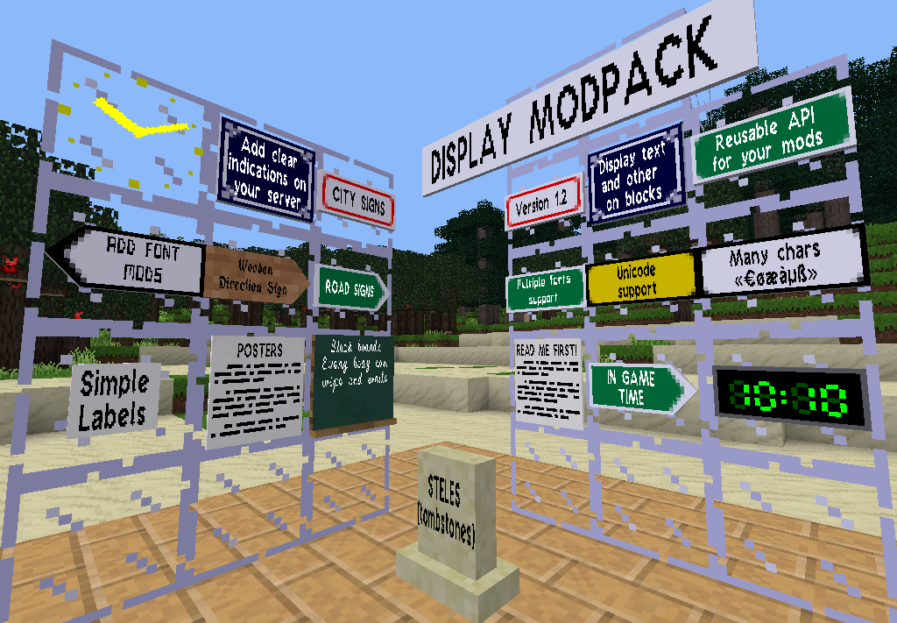

# Display Modpack

This modpack provides mods with dynamic display. Mods are :

- **display_lib**: A library for adding display entities to nodes;
- **font_lib**: A library for displaying fonts on entities;
- **ontime_clocks**: A mod providing clocks which display the ingame time;
- **signs**: A mod providing signs and direction signs displaying text;
- **signs_road**: A mod providing road signs displaying text;
- **steles**: A mod providing stone steles with text;

For more information, see the [forum topic](https://forum.minetest.net/viewtopic.php?t=19365) at the Minetest forums.

## Changelog

### 2017-12-19

This change is a preparation to merge Andrzej Pieńkowski fork (apienk) : new font and support of UTF chars.

- Font\_lib support for multiple fonts (nothing yet visible in mods) ;

- Font\_lib support for Unicode characters (limited to Unicode Plane 0: 0000-FFFF, see [Wikipedia](https://en.wikipedia.org/wiki/Unicode)) ; 

- New "default" font with original textures from Vanessa Ezekowitz (VanessaE) ;

### 2017-12-10

- Compatibility of signs mod with signs_lib (thanks to gpcf) ;

- Added large banner in road signs (thanks to gpcf) ;

### 2017-08-26

- Changed signs from wallmounted to facedir to improve textures and make it possible to use screwdriver. 
**IMPORTANT** : Map will be updated to change to new nodes but inventory items will turn into "Unknown items" and have to be re-crafted.

- Intllib support added with french translation (whole modpack, thanks to fat115) ;

- Punch on nodes to update entity (signs, signs_road and steles). Usefull in case of /clearobjects ;

- Changed wooden direction sign textures (signs) ;

- Added back and side textures to all signs (road_signs) ;

- Added more sign types : White/yellow/green signs and direction signs (signs_road) ;

