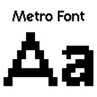

# Metro font minetest mod for font API

This mod adds Metro font to Font API mod (from [display_modpack](https://github.com/pyrollo/display_modpack)).

For more information, see the [forum topic](https://forum.minetest.net/viewtopic.php?t=13563) at the Minetest forums.
 
This font includes uppercase, lowercase and many accentuated latin letters, greek and cyrillic letters.

 
**Dependancies**: font_api

**License**: code under LGPL v2.1, font under CC-BY-SA 3.0

## Original Font

**Original font**: [Metro by Christian Munk](https://fontstruct.com/fontstructions/show/723864/metro_sans)

**License**: CC-BY-SA
