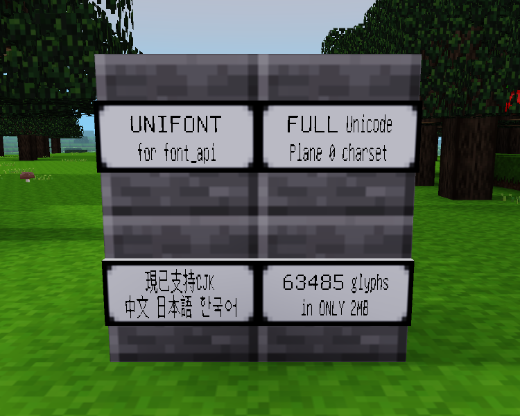

# Unifont for Minetest: Full Unicode Plane 0 charset (60000+ characters!)

GNU Unifont (v14.0.01) for Font API mod (from [display_modpack](https://github.com/pyrollo/display_modpack)).

- Full Unicode Basic Multilingual Plane (BMP) with 63485 characters
- Lightweight, data only ~2MB in size
- Duospaced (glyphs in either 8x16 or 16x16)

Requires `font_api` mod.

## Trivia

- You can use Unicode fullwidth forms (U+FF01--FF5E) to display wider letters & numbers (as shown in the screenshot above)
- GNU Unifont is also the same font used in Minecraft for Unicode display.

## Copyright

Copyright 2021 SyiMyuZya

License: [GPL 3.0 or later](https://www.gnu.org/licenses/gpl-3.0.html)

GNU Unifont: ©️ GNU Unifont authors, licensed under GPL version 2.0 or later
